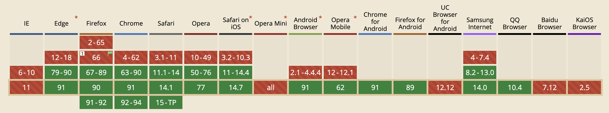

# @furo/precompiled

Use the precompiled components directly in your HTML file.
No build step needed. 

> **Warning** This package was created for our demo systems, so we can use and show our stuff in a HUGO generated page.
The files are very big at the moment, because they are not optimized yet.


## Installation 

The version of this package represents the version of @furo/collection

### CDN
Install ALL components including the UI5 components *not recomended*
```html
<script type="module" src="/config/init.js"></script>
<script type="module" src="https://cdn.jsdelivr.net/npm/@furo/precompiled@1.4.3/dist/furo-fbp.js"></script>
<script type="module" src="https://cdn.jsdelivr.net/npm/@furo/precompiled@1.4.3/dist/framework.js"></script>

<script type="module" src="https://cdn.jsdelivr.net/npm/@furo/precompiled@1.4.3/dist/layout.js"></script>
<script type="module" src="https://cdn.jsdelivr.net/npm/@furo/precompiled@1.4.3/dist/app.js"></script>
```

### NPM

```bash
npm i -S @furo/precompiled
```

```html
<script type="module" src="/config/init.js"></script>
<script type="module" src="/node_modules/@furo/precompiled/dist/furo-fbp.js"></script>
<script type="module" src="/node_modules/@furo/precompiled/dist/framework.js"></script>

<script type="module" src="/node_modules/@furo/precompiled/dist/layout.js"></script>
<script type="module" src="/node_modules/@furo/precompiled/dist/app.js"></script>
```

## Init file [optional]
When you want to use the **data** components or want to set the locales or install your translations, define and load the `init.js` from your page.

[*index.html*]
```html
 <!-- init is needed because we use data components -->
  <script type="module" src="/config/init.js"></script>
  <script type="module" src="dist/furo-fbp.js"></script>
```

[*/config/init.js*]
```javascript
import { Init, i18n,  Env } from '/dist/framework.js'
import {Types,Services} from "./data_environment.js";

/**
 * Register resource bundle i18n
 */
import { Translations } from './translations.js';
i18n.registerResBundle(Translations);

/**
 * Register the types and services which was generated by furo
 */
Init.registerApiTypes(Types);
Init.registerApiServices(Services);

/**
 * register the API prefix based on the APPROOT.
 * This information is used for furo-deep-link and furo-reverse-deep-link to resolve the api address.
 *
 * We use /api here, because we do not have a dedicated host like api.xxx.com for the api services
 * @type {string}
 */
Env.api.prefix = `/api`;
Init.applyCustomApiPrefixToServicesAndTypes(Env.api.prefix);


/**
 * Translate static messages in SPEC
 */
let locale = 'de_ch';
if (i18n.resbundle[Env.locale.toLowerCase().replace('-', '_')]) {
  locale = Env.locale.toLowerCase().replace('-', '_');
}
Init.translateStaticTypeMessages(locale);


```

## Compatibility Table

